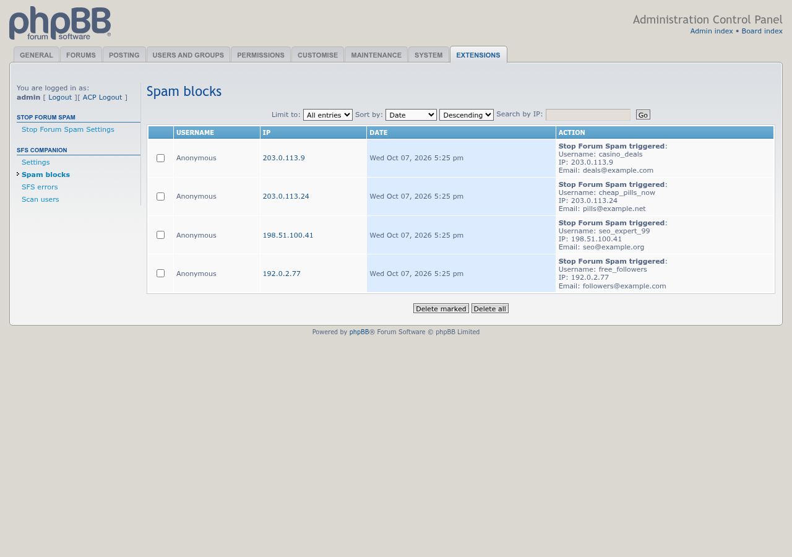
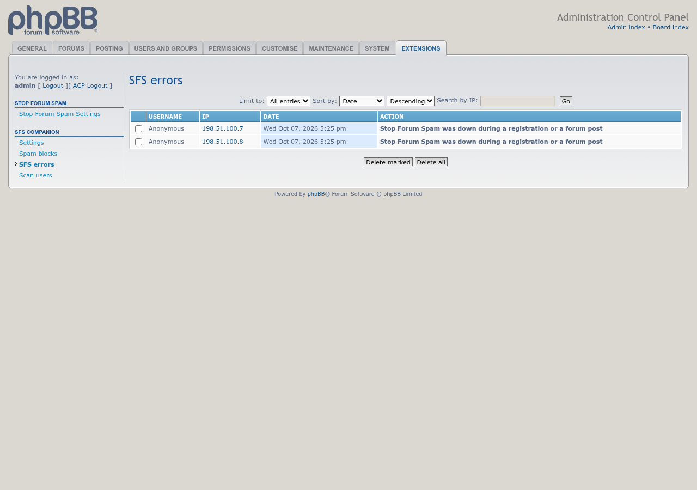

# SFS Companion

 

Companion tools for the Stop Forum Spam extension: browse what it blocked, look up or remove suspected spammers, and catch bots with a honeypot.

## Features

- **Spam blocks / SFS errors** — two ACP log pages, filtered from phpBB's own log table down to just what `phpbbmodders/stopforumspam` has logged, with sort, IP search, delete, and an auto-prune cron job
- **Scan users** — lists recently-registered users and checks each one against StopForumSpam inline, with a one-click report-and-remove action
- **Check SFS** — a manual lookup link on member profiles and in the ACP user overview (gated by a dedicated `m_chk_sfs` permission, so it can be delegated to moderators without full admin rights)
- **Honeypot** — hidden fields real users never see, plus a minimum time between showing a form and submitting it, on registration, posting and private messages. Registrations that trip a check are rejected. On posts and PMs the account is quietly moved into a hidden group that can't post or reply, and staff are notified if it already had enough posts to look established. The honeypot can be turned off entirely, or per form. Administrators and moderators are never restricted or banned; their trips are still logged.
- **Honeypot trips** — an ACP log of every trip with the username, email, IP, browser, which check tripped and how fast the form was sent, plus the subject and an excerpt for posts and PMs. A **Report** button sends a trip to Stop Forum Spam after you confirm it; trips are deleted automatically after 30 days by default.
- **Automatic IP bans** — after a set number of trips (3 within 24 hours by default) from the same IP, or optionally the same IP and email, or the same IP, email or username, the IP is banned for 30 days (adjustable, or permanent). By default only hidden-field trips count. The bans carry the admin-side reason `SFS Companion honeypot auto-ban` and show the visitor no reason, and one button in the ACP deletes all of them while leaving other bans alone.

## Screenshots

<table>
  <tr>
    <td align="center"> Spam blocks log</td>
    <td align="center"> SFS errors log</td>
    <td align="center"> Profile lookup link (highlighted)</td>
  </tr>
</table>

Click a screenshot for the full size. All screenshots, including the settings page, are on the [Screenshots wiki page](https://github.com/phpbbmodders/sfscompanion/wiki/Screenshots).

## Requirements

- phpBB 3.3.19 or later
- PHP 8.0 or later
- [phpbbmodders/stopforumspam](https://github.com/phpbbmodders/stopforumspam) installed and enabled. This extension won't enable without it.

## Installation

1. Copy the extension to `/ext/phpbbmodders/sfscompanion`
2. In the Administration Control Panel, go to **Customise → Manage extensions**
3. Enable the **SFS Companion** extension (`phpbbmodders/stopforumspam` must already be enabled)
4. Set the log prune interval under **ACP → Extensions → SFS Companion → Settings**, and the honeypot options under **Honeypot**

### Coming from phpbbmodders/honeypot

The honeypot is now part of SFS Companion. Disable and delete the data of the old **Honeypot** extension, delete `/ext/phpbbmodders/honeypot`, then install or update SFS Companion. Its old log entries and restricted group are not carried over.

## Upgrading from rmcgirr83/stopforumspam

Stop Forum Spam is now installed as `phpbbmodders/stopforumspam`. Upgrade in this order, or the board can fail to load while SFS Companion points at a disabled extension:

1. Disable **SFS Companion**
2. Disable the old **Stop Forum Spam** (do **not** delete its data)
3. Upload the new Stop Forum Spam to `/ext/phpbbmodders/stopforumspam` and this version of SFS Companion to `/ext/phpbbmodders/sfscompanion`
4. Enable **Stop Forum Spam**, then **SFS Companion**
5. Delete the `/ext/rmcgirr83/stopforumspam` folder and purge the board cache

## TODO

Ideas not yet built, practical and speculative alike: [`docs/TODO.md`](docs/TODO.md).

## Contributing

Contributions are welcome!

- **Bug reports**: [Open an issue](https://github.com/phpbbmodders/sfscompanion/issues).
- **Everything else** (questions, feature requests, ideas, general discussion): [Use Discussions](https://github.com/orgs/phpbbmodders/discussions), or the [community forum](https://www.phpbbmodders.com/community/).
- Pull requests are welcome for bug fixes or discussed features.

## Acknowledgments

- Built from two original extensions by Sheer: [phpbb3.1-3.2-Stop_Spam_Register](https://github.com/AlexSheer/phpbb3.1-3.2-Stop_Spam_Register) (the log-viewer piece) and [phpbb3.2-Stopforumspam](https://github.com/AlexSheer/phpbb3.2-Stopforumspam) (the scanner/finder piece), reworked to delegate all StopForumSpam API calls to [phpbbmodders/stopforumspam](https://github.com/phpbbmodders/stopforumspam)'s own service instead of duplicating that logic.
- The honeypot comes from the separate [phpbbmodders/honeypot](https://github.com/phpbbmodders/honeypot) extension, now merged in.
- Code review, bug fixes, and documentation assisted by [Claude](https://www.anthropic.com/claude).

## License

This extension is licensed under the **GNU General Public License v2.0**.

See [license.txt](license.txt) for more information.
